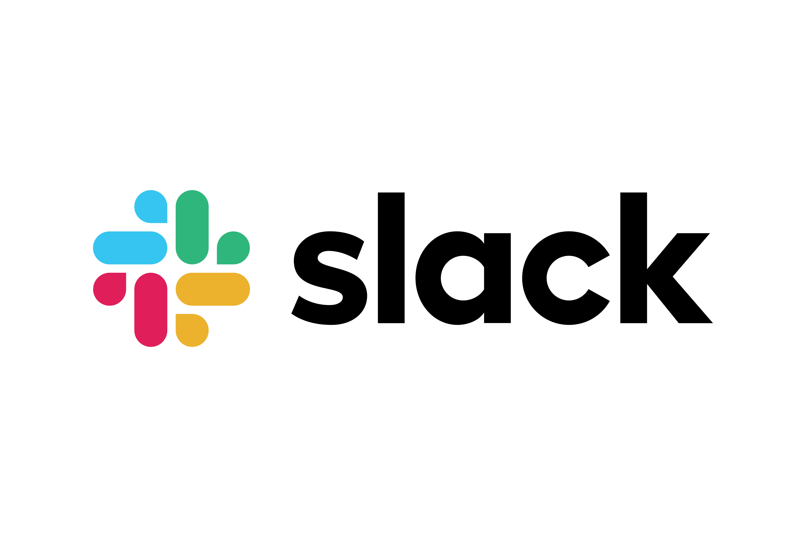

# Workshop goals and topics

 - We want to make the computers work harder so we can do more meaningful work. This workshop introduces foundational tools and techniques that make computational projects simpler, more powerful, and more reproducible.

 - By the end of the workshop, attendees will be able to
   - Understand how to use a range of basic Bash commands including techniques
     to view and manipulate files from the command line.
   - Combine Bash commands together to create custom scripts.
   - Understand basics of importing data into R and ways to clean/manipulate data
   - Visualize data as plots

 - Our purpose is not to be exhaustive, there is a lot that we cannot cover in
   the allotted time, and we don't expect anyone to be an expert at the end of
   the workshop. 

- We hope that this introduction helps you over the steepest parts of the learning curve and gives a sense of what’s possible so you can 
recognize these techniques when you see them and, with some independent study, apply them in your own work.

 - Please let us know if there is anything we can do to improve the workshop experience.

## About the workshop team
|   |  |  |
|:-:|:-:|:-:|
| **Chris** | **Dana** | **Raymond** |

 

# Code of Conduct

- Be kind to others. Do not insult or put down others. Behave professionally. Remember that
  harassment and sexist, racist, or exclusionary jokes are not appropriate for the workshop.

- All communication should be appropriate for a professional audience including people of many
  different backgrounds. Sexual language and imagery is not appropriate.

- The Bioinformatics Core is dedicated to providing a harassment-free community for everyone,
  regardless of gender, sexual orientation, gender identity and expression, disability, physical
  appearance, body size, race, or religion. We do not tolerate harassment of participants in any
  form.

- Thank you for helping make this a welcoming, friendly community for all.

- If you have questions about the CoC please reach out to the hosts during the workshop, or
  email us at bioinformatics-workshops@umich.edu.

- To report a CoC incident/concern, please email Chris Gates (Bioinformatics Core, Managing
  Director) at cgates@umich.edu or contact the University of Michigan Office of Institutional
  Equity at institutional.equity@umich.edu.
 
 

## 

- **Slack** can be used to communicate to the group or to individuals and has a
  few features/behaviors that we prefer over Zoom's Chat functionality.

  - Slack messages will be posted to the **2023-02-computational-foundations** channel.
    Click on the channel in the left pane (1) to select this channel.
  - You can type in the **message field** (2); click **send** (3) to
    post your message to everyone.
  - Helpers will respond in a Slack thread (or pose the question to the instructor)
  - You can respond in a message thread by hovering over a message to trigger
    the message menu and clicking the **speech bubble** (4).

### Exercise: Responding in Slack thread
What is one thing you hope to learn in this workshop?
 
 

## Review of Key communication patterns
| |  |  |
|-|:-:|-|
| "I have an urgent question" |  | **Post a question** |
| "I have a general question" | | **Post a question** |
| "I'm stuck / I need a hand" | | **Post a note** |
| Instructor check-in |  -or-  | |
| Instructor Slack question | | **Respond in Slack thread** |
 
 

### Exercise: Group checkpoint
  - Using Zoom, give me a **green-check** if you feel like you understand
    communication patterns or **red-X** if you need clarification.
 
 

## Arranging your screens
It is important that you can see:

 - Zoom (instructor's shared screen + reactions)
 - Your terminal/command window (days 1-2) or R/Studio (days 2-3)
 - Slack
 - Lesson plan web page

 
 

# Any questions?
 -
 -

---
# Thank you to our sponsors/contributors

## Acknowledgements

* This workshop content is licensed under a [Creative Commons Attribution 4 License](https://creativecommons.org/licenses/by/4.0/){target="_blank"}.

* Large sections of this workshop content have been adapted and extended from materials created by [Software Carpentry](https://software-carpentry.org/lessons/){target="_blank"}. These are open access materials distributed under the terms of the [Creative Commons Attribution license (CC BY 4.0)](http://creativecommons.org/licenses/by/4.0/){target="_blank"}, which permits unrestricted use, distribution, and reproduction in any medium, provided the original author and source are credited.

* The workshop Code of Conduct has been adapted the [NumFocus Code of Conduct](https://numfocus.org/code-of-conduct){target="_blank"} which itself draws from from numerous sources, including the Geek Feminism wiki, created by the Ada Initiative and other volunteers, which is under a Creative Commons Zero license, the Contributor Covenant version 1.2.0, the Bokeh Code of Conduct, the SciPy Code of Conduct, the Carpentries Code of Conduct, and the NeurIPS Code of Conduct.
